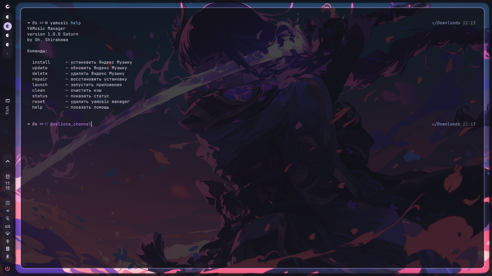

# YAMusic Manager

Simple Yandex Music installer and manager for Arch-based Linux distributions.

Built for users who don't want to manually unpack `.deb` packages, fix Electron sandbox permissions, repair broken installs, or clean leftovers after updates.

YAMusic Manager automates the entire process.

---

## About

Yandex officially provides only a Debian package for Linux.

That works on Debian/Ubuntu, but on Arch Linux, CachyOS, and other Arch-based systems it requires manual extraction and setup.

YAMusic Manager solves that.

It downloads the latest stable package directly from Yandex servers, extracts it, installs files into the proper system locations, applies required permissions, refreshes desktop entries and icons, and fully cleans temporary data.

No `dpkg`.
No `apt`.
No manual unpacking.

One command.

---

## Features

* Install Yandex Music directly from official Yandex servers
* Always download the latest version dynamically
* Update installed version safely
* Full uninstall without leftovers
* Repair broken permissions and Electron sandbox
* Launch directly from terminal
* Clean application cache
* Check installation status and current version
* Self-update the manager from GitHub RAW
* Self-delete the manager completely

---

## Supported systems

Works on:

* Arch Linux
* CachyOS
* EndeavourOS
* Manjaro
* Any Arch-based Linux distribution

Architecture:

* x86_64 only

---

## Installation

Clone repository:

```bash
git clone https://github.com/shshirakawa/yamusic-manager.git
cd yamusic-manager
```

Make executable:

```bash
chmod +x yamusic.bash
```

Install globally:

```bash
sudo install -m755 yamusic.bash /usr/local/bin/yamusic
```

Done.

---

## Usage

Install:

```bash
yamusic install
```

Update:

```bash
yamusic update
```

Delete Yandex Music completely:

```bash
yamusic delete
```

Repair installation:

```bash
yamusic repair
```

Launch application:

```bash
yamusic launch
```

Clean application cache:

```bash
yamusic clean
```

Check installation status:

```bash
yamusic status
```

Show manager version:

```bash
yamusic version
```

Update manager itself:

```bash
yamusic self-update
```

Remove manager completely:

```bash
yamusic self-delete
```

Show help:

```bash
yamusic help
```

---

## Internal behavior

YAMusic Manager automatically:

* fetches the latest release metadata from Yandex
* follows CDN redirects
* validates package integrity
* extracts package content without `dpkg`
* installs files into `/opt` and `/usr/share`
* fixes Electron sandbox permissions (`chrome-sandbox`)
* updates desktop database and icon cache
* cleans temporary files after completion
* prevents concurrent execution with file locking

---

## Uninstall behavior

### `yamusic delete`

Fully removes:

* application files
* desktop entries
* icons
* docs
* configs
* cache
* local state

No leftover Yandex Music files remain.

---

### `yamusic self-delete`

Fully removes:

* yamusic binary
* yamusic backup
* temporary manager files
* lock files

Yandex Music itself remains untouched.

---

## Screenshot

Add screenshot here:

```md

```

---

## Author

Created by **Sh. Shirakawa**

Telegram:
https://t.me/veliona_channel

---

## License

YAMusic Manager is distributed under the **Personal Use License (PUL) v1.0**

Allowed:

* personal use
* local modifications
* private builds

Not allowed:

* forks
* redistribution
* republishing
* rebranding
* commercial use
* removing author watermark

Read the full license in the `LICENSE` file.
